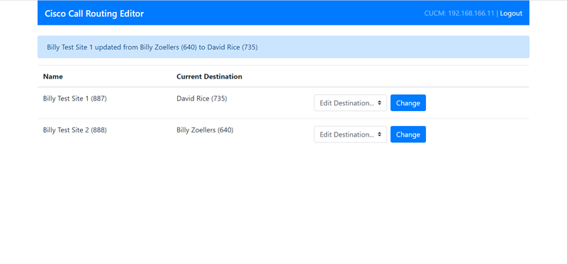

# Cisco Call Routing Editor
[](https://developer.cisco.com/codeexchange/github/repo/deandorton/cucm-call-routing-editor)

A simple call routing editor for Cisco CUCM

**Purpose:** Provide CUCM power users an easy to user interface to modify the calledPartyTransformationMasks for a set of Translation Patterns in CUCM. Sites or services that might need routing changes can be assigned as Translation Patterns, and possible destinations can be assigned as calledPartyTransformationMasks.



## Installation
1. Install Docker and Docker Compose
2. Download this repository, either as a ZIP file or by using `git pull`
3. Create a `data.json` file following the specifications below, or by coping `data-sample.json`
4. Create a `.env` file with the appropriate enviornment variables for you enviornment
5. Run `docker-compose -p cucm-routing-editor up -d`

### Enviornment Variables
- **CUCM_HOST** Hostname (must be resolvable) or IP address of CUCM server with AXL service enabled
- **CUCM_USER** User with AXL API Access permission in CUCM
- **CUCM_PASS** Password for *CUCM_USER*
- **CUCM_VERSION** Major version of CUCM (i.e. 12.5, 12.0). *Defaults to 12.5*
- **SECRET_KEY**: Secret of random characters for password hashing
- **WEBUI_PASSWORD**: Password for the 'editor' user in the web UI

### data.json File
`data.json` defines the Translation Pattern UUIDs that are allowed to be modified, as well as the calledPartyTransformationMasks that can be applied to each Translation Pattern. The format of this file is
```
{
  "TranslationPatternUUIDs": [
    "f5c217a8-41e5-ca31-ab6e-62c2",
    "47254316-7faa-19eb-06d5-42fa821750eb"
  ],
  "CalledPartyTransformationMasks": {
    "Destination 1": "3930",
    "Destination 2": "3931"
  }
}
```
A sample file can be found at *data-sample.json*

## License
Copyright (C) 2020  Billy Zoellers, Dean Dorton Allen Ford, PLLC

This program is free software: you can redistribute it and/or modify it under the terms of the GNU General Public License 
as published by the Free Software Foundation, either version 3 of the License, or (at your option) any later version.
This program is distributed in the hope that it will be useful, but WITHOUT ANY WARRANTY; without even the implied warranty 
of MERCHANTABILITY or FITNESS FOR A PARTICULAR PURPOSE.  See the GNU General Public License for more details.
You should have received a copy of the GNU General Public License along with this program.
If not, see <http://www.gnu.org/licenses/>.